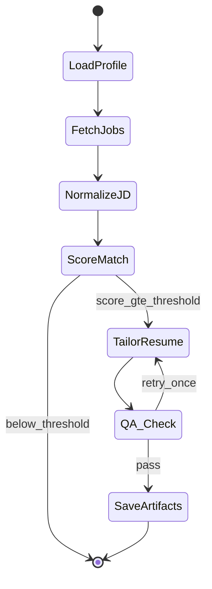

# Job Apply Agent — Feature Specification

> **Single source of truth** for all features, architecture, and behavior.  
> Any builder agent implementing this project **must read this file first** and **update it** when adding or changing features.

**Last updated:** 2026-09-16  
**Status:** Phase 1 implemented and verified against live LinkedIn — **no remote push**  
**Inspired by:** [Skillmeet.ai](https://skillmeet.ai) multi-signal job relevance search

### Development constraint

> **Local only.** All code stays on this machine under `c:\Projects\Crystall_ball\job-apply-agent\`.  
> Do **not** `git init` + remote, `git push`, or publish to GitHub/GitLab until explicitly requested by the owner.  
> LinkedIn session files (`storage_state.json`) and API keys must never leave the local machine.

---

## Table of contents

1. [Product overview](#1-product-overview)
2. [Deployment model](#2-deployment-model)
3. [Phase 1 features](#3-phase-1-features)
4. [Phase 2 features (deferred)](#4-phase-2-features-deferred)
5. [User profile inputs](#5-user-profile-inputs)
6. [Job ingestion](#6-job-ingestion)
7. [Match engine](#7-match-engine)
8. [Resume tailoring & ATS](#8-resume-tailoring--ats)
9. [Scheduler](#9-scheduler)
10. [Tech stack](#10-tech-stack)
11. [LangGraph agent pipeline](#11-langgraph-agent-pipeline)
12. [API endpoints](#12-api-endpoints)
13. [Data model](#13-data-model)
14. [Project structure](#14-project-structure)
15. [UI screens](#15-ui-screens)
16. [Design rules](#16-design-rules)
17. [Risks & constraints](#17-risks--constraints)
18. [Sprint checklist](#18-sprint-checklist)
19. [FAQ](#19-faq)

---

## 1. Product overview

Personal job-application agent that:

1. Collects your profile, skills, and base resume via a web UI
2. Scrapes relevant jobs (LinkedIn primary) every **6 hours** on your local PC
3. Scores each job against your profile (target: **50–70% match**)
4. Generates an **ATS-friendly, job-specific resume** for qualifying matches
5. *(Phase 2)* Auto-applies via LinkedIn Easy Apply or company career portals

**One-liner:** Profile once → scrape → score → tailor resume → download and apply.

---

## 2. Deployment model

**Hybrid — no static IP required.**

| Component | Runs on | Purpose |
|-----------|---------|---------|
| Web UI (Next.js) | Cloud | Forms, dashboard, resume download |
| API (FastAPI) | Cloud | CRUD, match engine, resume tailor |
| PostgreSQL + pgvector | Cloud | Profiles, jobs, matches, scores |
| S3 / MinIO | Cloud | Resume files (base + tailored) |
| Scraper worker (Playwright) | **Your PC** | LinkedIn scraping with home residential IP |

Cloud **never** scrapes LinkedIn directly. LinkedIn session cookies stay **local only** (`storage_state.json`).

---

## 3. Phase 1 features

### 3.1 Profile management

- [x] Create / edit user profile (all fields in [§5](#5-user-profile-inputs))
- [x] Upload base resume (PDF or DOCX)
- [x] Parse resume → structured JSON preview in UI
- [x] Validate required fields before enabling scraper

### 3.2 Job scraping (local worker)

- [x] Playwright-based LinkedIn scraper with persistent session
- [x] One-time manual LinkedIn login → save session locally
- [x] Build search URL from profile (role, location, experience, 24h filter)
- [x] Extract job cards + full job descriptions
- [x] Push normalized jobs to cloud API (`POST /jobs/bulk`)
- [x] Dedup by `(source, external_id)` or content hash
- [x] Report scrape run metadata (`POST /scrape-runs`)
- [x] Safety: rate limits, CAPTCHA detection → pause + UI alert
- [x] Configurable max jobs per run (default 25–50)

### 3.3 Job matching (Skillmeet.ai-style)

- [x] Hard filters: location, salary, experience, posted ≤24h, exclude keywords
- [x] Semantic ranking: TF-IDF cosine + keyword overlap (pgvector optional via Postgres)
- [x] Hybrid score with explainable reasons (top 5)
- [x] Threshold gate: only jobs ≥50% proceed to tailoring (tunable in UI)
- [x] Job dashboard sorted by score, freshness, company

### 3.4 Resume tailoring

- [x] Per-job tailored resume generation (LangGraph pipeline)
- [x] Rephrase + reorder bullets to align with JD keywords
- [x] Reorder skills section (JD must-haves first)
- [x] **Never invent** experience, employers, dates, or skills
- [x] QA check: fact traceability + ATS format rules
- [x] Output: ATS-safe `.docx` (optional PDF export)
- [x] Show `diff_summary` — what changed vs base resume
- [x] Download tailored resume per job from dashboard

### 3.5 Scheduler

- [x] Local cron: every **6 hours** (`0 */6 * * *`) = 4 runs/day, 28/week
- [x] Each run fetches jobs posted in **last 24 hours** (overlap intentional)
- [x] Worker pulls latest profile from API before each run

### 3.6 Optional supplement (Sprint 2.5)

- [ ] Adzuna API integration (free tier backup if LinkedIn throttles)
- [ ] Merge + dedup with Playwright results

---

## 4. Phase 2 features (deferred)

> Store Phase 2 fields in DB during Phase 1; do not build UI logic yet.

- [ ] LinkedIn Easy Apply — Playwright form filler
- [ ] Company career portal adapters (Greenhouse, Lever, Workday)
- [ ] Application Q&A vault (pre-filled answers)
- [ ] Per-job cover letter generation
- [ ] Company blacklist enforcement
- [ ] Human-in-the-loop: LangGraph interrupt before submit — user approves in UI
- [ ] Application tracking (applied / rejected / interview)

---

## 5. User profile inputs

### Required (Phase 1)

| Field | Type | Used for |
|-------|------|----------|
| Base resume | File (PDF/DOCX) | Parsed into structured JSON |
| Target roles | Multi-select text | Query expansion + hard filter |
| Skills — must-have | Tag list | High-weight keyword + embedding match |
| Skills — nice-to-have | Tag list | Lower-weight match |
| Experience years | Number | Filter + scoring |
| Seniority level | Enum (entry/mid/senior/lead) | Filter + scoring |
| Location(s) | Multi text | Geo filter |
| Work mode | Enum (remote/hybrid/onsite/any) | Geo filter |
| Salary min / max | Number + currency | Hard filter |
| Current role | Text | Skillmeet-style relevance boost |
| Current company | Text | Relevance boost |
| Industry | Text | Domain boost/de-boost |

### Recommended (Phase 1 UI)

| Field | Used for |
|-------|----------|
| Work authorization / visa | Filter jobs you cannot take |
| Willing to relocate + cities | Location scoring |
| Employment type | FT / contract / internship filter |
| Keywords to exclude | Negative filter ("Java", "clearance") |
| Industry preferences | Boost/de-boost |
| Company size preference | Startup / mid / enterprise |
| Portfolio, GitHub, LinkedIn URL | Resume + future auto-apply |
| Contact email, phone | Future application pre-fill |
| Education + certifications | ATS sections + scoring |
| Notice period / earliest start | Filter urgent roles |
| Max jobs per run | Cost + rate-limit guard |

### Phase 2 only (store early)

| Field | Used for |
|-------|----------|
| Application Q&A vault | Auto-fill forms |
| Cover letter tone + template | Cover letter gen |
| Blacklist companies | Never show or apply |

---

## 6. Job ingestion

### Primary: Playwright + LinkedIn

**Why Playwright:** LinkedIn is a React SPA with auth and anti-bot. HTTP scraping fails.

**Search URL template:**
```
https://www.linkedin.com/jobs/search/
  ?keywords={roles}
  &location={location}
  &f_E={experience_level}
  &f_TPR=r86400          # posted last 24h
  &f_WT={remote_filter}  # optional
  &sortBy=DD               # most recent
```

**Per-run flow:**
1. Daemon pulls active profile from API
2. Launch Playwright with saved `storage_state.json`
3. Navigate search URL → scroll → extract job cards
4. For each new job: open detail page → extract full JD
5. POST normalized jobs to API
6. Report scrape run complete

**Extracted fields:**

| Source page | Fields |
|-------------|--------|
| Search results | `job_id`, title, company, location, posted_at, apply_url |
| Job detail pane | Full JD text |

**Selectors (authenticated UI — verified live):**

| Purpose | Selector |
|---------|----------|
| Job list item | `li[data-occludable-job-id]` |
| Job id | `data-occludable-job-id` attribute |
| Title | `a.job-card-container__link` |
| Company | `.artdeco-entity-lockup__subtitle` |
| Location | `.artdeco-entity-lockup__caption` |
| Description | `#job-details` (right-hand pane) |

Guest-page selectors such as `div.base-card` do **not** exist when logged in.

**Two behaviours that are easy to get wrong:**

1. **CAPTCHA detection must not substring-match `"captcha"`.** LinkedIn loads
   Google reCAPTCHA (`recaptcha__en.js`) on normal pages, so a naive check
   reports a block on every run. Only trust redirects to
   `/checkpoint/challenge` or `/authwall`, or explicit challenge DOM nodes.
2. **The results list is virtualized.** Occluded items render no text, so
   collect cards incrementally while scrolling, and read the JD from the
   right-hand pane after clicking the card. The standalone `/jobs/view/{id}`
   page uses a different layout with no stable description container.

**Troubleshooting:** run `python diagnose.py` in `worker/scraper` — it reports
session path, login state, real vs false CAPTCHA signals, and live selector
counts, and saves a screenshot to `debug/page.png`.

**Safety rails:**
- 2–5s random delay between pages
- Stop on CAPTCHA → alert user, pause until re-login
- No parallel LinkedIn sessions
- Max jobs/run from profile setting

### Supplement: Free APIs (optional)

| API | Cost | Limits | Notes |
|-----|------|--------|-------|
| Adzuna | Free | 250/day, 2,500/month | Best free supplement |
| JSearch | Free tier | 200/month | Google for Jobs aggregate |
| Remotive | Free | ~4 polls/day | Remote only |
| Arbeitnow | Free | Public JSON | EU/remote |
| LinkedIn official API | N/A | — | **Not available for job search** |

---

## 7. Match engine

### Skillmeet.ai-style multi-signal relevance

1. **Hard filters** — location, exp, salary, posted ≤24h, exclude keywords, visa
2. **Semantic rank** — embed JD vs profile (roles + skills + experience bullets)
3. **Personal context boost** — current domain, seniority trajectory, role synonyms
4. **Freshness** — `posted_at` descending

### Hybrid score formula

```
final = 0.45 × semantic
      + 0.25 × skill_overlap
      + 0.15 × role_match
      + 0.10 × exp_fit
      + 0.05 × freshness
```

- **≥50%** → eligible for resume tailoring (threshold tunable in UI)
- Store `match_score` + `match_reasons[]` (top 5 explainable reasons)

**`semantic` is term coverage, not raw-count cosine.** Cosine between a ~30-token
profile and a 2,000-word JD is length-penalized toward zero, which capped every
score near 30% and made the 50% threshold unreachable. Coverage measures the
fraction of the profile's distinctive terms present in the JD. Tokens containing
digits are excluded so phone numbers and postcodes from resume parsing cannot
pollute the profile vocabulary.

**`role_match` takes the best-fitting target role**, not the average across all of
them — otherwise a perfect match on one target role was penalized for the other
target role being absent.

**Scores are only as good as the profile.** A profile whose roles and skills do
not reflect the uploaded resume will legitimately score below threshold against
every job. Reference point: real scraped Bangalore jobs score 59.9% and 58.9%
against an aligned full-stack profile, versus a 41.7% ceiling against a
mismatched one.

**Rescoring:** `POST /matches/rescore?profile_id=...` recomputes every match
after changing the threshold, the profile, or the resume — no re-scrape needed.
Saving the profile and uploading a resume both trigger this automatically.

### Hard filters

Applied before scoring; a failure returns score `0` with the reason stored.

| Filter | Behaviour |
|--------|-----------|
| Exclude keywords | **Whole-word** match on title and JD |
| Salary | Reject when `job.salary_max < profile.salary_min` |
| Location | Profile location (plus aliases) must appear in job location, or the job is remote and `work_mode` allows it |

**City aliases matter.** LinkedIn returns `Bengaluru, Karnataka, India` while users
type `Bangalore`, so a plain substring test rejected every valid local job.
`CITY_ALIASES` in `match_engine.py` maps the common Indian city renames
(Bangalore/Bengaluru, Bombay/Mumbai, Madras/Chennai, Gurgaon/Gurugram, and others).

**Exclude keywords are whole-word** so `sales` no longer excludes `Salesforce`.
Note it still excludes any job whose description genuinely uses the word "sales";
prefer specific keywords such as `sales representative` over `sales`.

### Benchmark

`python benchmark_match.py` (in `apps/api`) scores the stored jobs against a
reference software profile. Use it after changing weights to confirm the
threshold is still reachable — real Bangalore listings currently yield 5 matches
above 50%, topping out at 62%.

---

## 8. Resume tailoring & ATS

### Backend components

| Component | Tech | Role |
|-----------|------|------|
| Resume parser | `pdfplumber` / `python-docx` | Base resume → JSON (once) |
| JD normalizer | LLM structured output | Extract skills, keywords, seniority from JD |
| Gap analyzer | LLM or keyword diff | Map JD requirements → your bullets |
| Tailor agent | LangGraph node + LLM | Rewrite bullets, reorder skills |
| QA check | LangGraph node | No fabrication + ATS rules |
| Renderer | `python-docx` + Jinja template | Produce final `.docx` |
| Storage | S3/MinIO + Postgres | `tailored_resumes` table |

### What tailor changes

**Does:**
- Reorder skills (JD must-haves first)
- Rewrite bullets with JD verbs/keywords (only if factually true)
- Trim irrelevant bullets for that role
- Align summary line with target role (if accurate)

**Does not:**
- Add fake companies, years, or skills
- Use tables, columns, icons, graphics
- Keyword-stuff invisible text

### ATS template rules

```
Headings: Summary | Skills | Experience | Education  (standard names only)
Layout:   single column
Font:     Arial or Calibri 10–11pt
Avoid:    headers/footers, text boxes, images, tables
Format:   "Action verb + metric + outcome" bullets
Output:   .docx primary (PDF secondary)
```

### Parsed resume JSON shape

```json
{
  "name": "string",
  "contact": { "email": "", "phone": "", "linkedin": "", "github": "" },
  "summary": "string",
  "skills": { "must_have": [], "nice_to_have": [] },
  "experience": [{
    "company": "string",
    "role": "string",
    "start_date": "YYYY-MM",
    "end_date": "YYYY-MM | present",
    "bullets": ["string"]
  }],
  "education": [{
    "institution": "string",
    "degree": "string",
    "year": "YYYY"
  }],
  "certifications": ["string"]
}
```

### Tailored output shape

```json
{
  "match_id": "uuid",
  "tailored_bullets": ["string"],
  "skills_ordered": ["string"],
  "diff_summary": "string",
  "docx_path": "s3://...",
  "pdf_path": "s3://... (optional)"
}
```

### QA checks

- Every fact traces to `parsed_resume` JSON
- No new employers, dates, or skills
- Standard ATS headings
- Max 5–7 bullets per role

---

## 9. Scheduler

| Setting | Value |
|---------|-------|
| Cron | `0 */6 * * *` |
| Frequency | 4 runs/day, 28 runs/week |
| Job window | Posted in last 24 hours |
| Runs on | Local PC daemon |
| Dedup | `(source, job_id)` or `(company, title, location)` hash |

---

## 10. Tech stack

| Layer | Choice |
|-------|--------|
| Agent orchestration | **LangGraph** |
| LLM / prompts | LangChain (structured output only) |
| API | **FastAPI** (Python) |
| UI | **Next.js 15 + React** |
| DB | **PostgreSQL + pgvector** |
| Queue (optional) | Redis + Dramatiq |
| Local scraper | **Playwright** (Python) |
| Resume parse | `pdfplumber` / `python-docx` + LLM |
| Resume output | `python-docx` + Jinja |
| Embeddings | `text-embedding-3-small` or `nomic-embed-text` |
| Auth | Clerk or Auth.js |
| Storage | S3 / MinIO |

---

## 11. LangGraph agent pipeline



| Node | Action |
|------|--------|
| `LoadProfile` | Load profile + parsed resume from DB |
| `FetchJobs` | Get new jobs with status `pending` |
| `NormalizeJD` | LLM extract: title, skills, exp, salary, location |
| `ScoreMatch` | Hybrid score → persist score + reasons |
| `TailorResume` | Rewrite bullets, reorder skills (no fabrication) |
| `QA_Check` | Verify ATS rules + fact traceability |
| `SaveArtifacts` | Render DOCX → S3 → update DB |

---

## 12. API endpoints

### Phase 1

| Method | Endpoint | Purpose |
|--------|----------|---------|
| POST | `/profiles` | Create/update profile |
| GET | `/profiles/{id}` | Get profile |
| POST | `/profiles/{id}/resume` | Upload base resume |
| GET | `/profiles/{id}/resume/parsed` | Get parsed JSON |
| GET | `/jobs` | List jobs (`?min_score=50&sort=score`) |
| GET | `/jobs/{id}` | Job detail + JD |
| POST | `/jobs/bulk` | Worker ingests scraped jobs |
| POST | `/scrape-runs` | Worker reports run metadata |
| GET | `/matches` | List matches for profile |
| POST | `/matches/rescore` | Recompute all scores for a profile |
| POST | `/matches/{id}/tailor` | Trigger resume tailoring |
| GET | `/matches/{id}/resume` | Download tailored resume |
| GET | `/scrape-runs` | Scrape history + errors |

### Worker-only (API key auth)

- `GET /profiles/active` — pull config for scrape run
- `POST /jobs/bulk`
- `POST /scrape-runs`

---

## 13. Data model

```
user_profiles
  id, user_id, all profile fields, created_at, updated_at

parsed_resumes
  id, profile_id, json_blob, source_file_path, parsed_at

job_postings
  id, source, external_id, title, company, location,
  jd_text, posted_at, url, salary_min, salary_max, raw_json, created_at

job_matches
  id, profile_id, job_id, score, reasons[], status, created_at
  status: pending | tailored | applied | skipped

tailored_resumes
  id, match_id, docx_path, pdf_path, diff_summary, created_at

scrape_runs
  id, profile_id, started_at, completed_at, jobs_found, errors, status
```

---

## 14. Project structure

```
job-apply-agent/
├── docs/
│   └── FEATURES.md          ← this file (source of truth)
├── apps/
│   ├── web/                   # Next.js UI
│   └── api/                   # FastAPI
├── worker/
│   └── scraper/               # Local Playwright daemon
├── agents/
│   └── graphs/                # LangGraph: match + tailor
├── packages/
│   └── shared/                # schemas, prompts, types
└── infra/
    └── docker-compose.yml     # postgres, redis, minio
```

---

## 15. UI screens

| Screen | Phase | Features |
|--------|-------|----------|
| Onboarding / Profile | 1 | All profile fields, resume upload |
| Resume preview | 1 | Parsed JSON, edit corrections |
| Job dashboard | 1 | Sorted matches, score, reasons, filters |
| Job detail | 1 | Full JD, match breakdown, tailor button |
| Tailored resume | 1 | Preview diff, download DOCX |
| Scraper status | 1 | Last run, jobs found, errors, CAPTCHA alert |
| Settings | 1 | Match threshold, max jobs/run, cron status |
| Applications | 2 | Applied / pending / tracking |

---

## 16. Design rules

1. **Never invent experience** — tailor = rephrase + reorder + keyword align only
2. **Idempotent scraping** — same job never processed twice
3. **Explainable matches** — always show top 5 reasons
4. **ATS output** — no columns, icons, text boxes, headers/footers
5. **Secrets local** — LinkedIn cookies + API keys only on your PC
6. **Cost control** — tailor only jobs ≥ threshold; cap jobs per run
7. **Docs stay current** — update this file when features change

---

## 17. Risks & constraints

| Risk | Mitigation |
|------|------------|
| LinkedIn ToS / account restriction | Personal use, rate limits, accept breakage |
| CAPTCHA | Pause scraper, alert user, manual re-login |
| DOM changes break selectors | Versioned selector config, maintenance sprint |
| LLM hallucination on resume | QA node + fact traceability check |
| Free API limits | Playwright primary; APIs as supplement only |
| Datacenter IP blocks | Hybrid: scrape locally only |

**No static IP required** — residential home IP via local worker.

---

## 18. Sprint checklist

### Sprint 1 — Profile + UI + docs
- [x] Repo scaffold + `docs/FEATURES.md` (this file)
- [x] Docker: Postgres, MinIO (`infra/docker-compose.yml`)
- [x] FastAPI profile CRUD + schema
- [x] Resume upload + parse + JSON preview
- [x] Next.js profile forms

### Sprint 2 — LinkedIn scraper
- [x] Playwright session setup
- [x] Search URL builder from profile
- [x] Job extraction + bulk ingest API
- [x] 6h local cron daemon
- [x] Scraper status in UI

### Sprint 3 — Match engine
- [x] Hybrid scoring + threshold (TF-IDF; pgvector via Postgres optional)
- [x] Hybrid scoring + threshold
- [x] Job dashboard with explainable reasons

### Sprint 4 — Resume tailor
- [x] LangGraph tailor + QA pipeline
- [x] ATS DOCX template
- [x] Per-job download + diff summary

### Sprint 2.5 (optional) — API supplement
- [ ] Adzuna integration + merge/dedup

---

### Resume parsing notes

PDF resumes frequently use **letter-spaced headings** (`W O R K  E X P E R I E N C E`).
The parser normalizes these before matching section headings; exact-string
heading matching silently produces an empty resume (no experience, no education,
and a "summary" containing the phone number).

Two-column PDF layouts interleave columns during text extraction, so parsed
sections can be noisy. Always review the parsed JSON preview in the UI and
correct the profile fields if needed.

---

## 19. FAQ

**Do I need a static IP?**  
No. Scraper runs on your PC with your home residential IP.

**Why hybrid deployment?**  
LinkedIn blocks cloud/datacenter IPs. Your real session + home IP is more stable.

**Why Playwright over APIs?**  
No free API gives full LinkedIn job depth. Playwright is primary; Adzuna/JSearch are optional backup.

**What match % triggers resume tailoring?**  
Default ≥50%, tunable in UI up to 70%.

**Will the agent fake experience on my resume?**  
No. QA node blocks any bullet not traceable to your parsed base resume.

**How often does it run?**  
Every 6 hours (4×/day), fetching jobs posted in the last 24 hours.

**When does auto-apply come?**  
Phase 2. Phase 1 = tailored resume download for manual apply.

---

## Builder agent instructions

When implementing any feature:

1. Read this file completely before writing code
2. **Work locally only** — no `git push`, no remote repo, no cloud deploy until owner approves
3. Check off completed items in the sprint checklist (§18)
4. Update relevant sections if behavior differs from spec
5. Add new endpoints to §12 and new fields to §5/§13
6. Bump **Last updated** date at top of file
